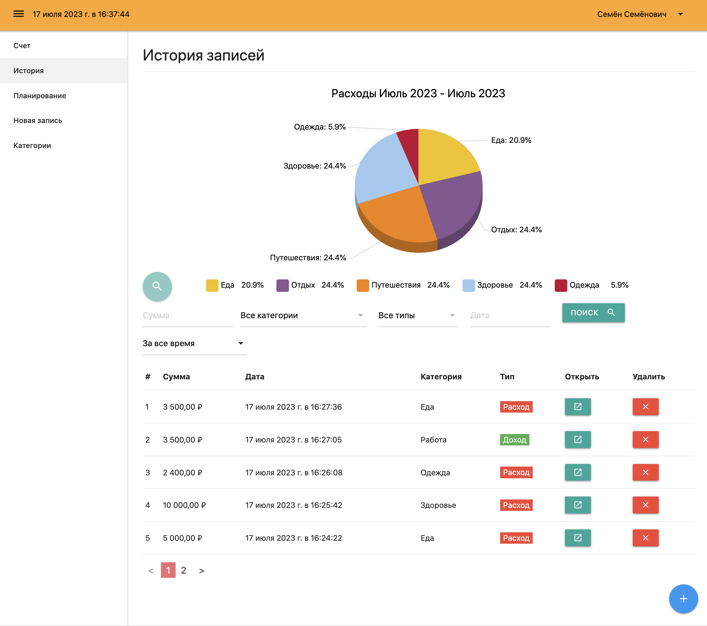

<h1 align="center"> HOME ACCOUNTING 💳 </h1> 

CRM system for managing income and expenses

## Technology Stack
Vue.js, Vuex, Router Vue, Vue CLI, Firebase (Realtime Database, Authentication, Cloud Functions)

<a href="https://vuejs.org/" target="_blank" rel="noreferrer">  </a>
<a href="https://www.w3.org/html/" target="_blank" rel="noreferrer">  </a> 
<a href="https://www.w3schools.com/css/" target="_blank" rel="noreferrer">  </a> 
<a href="https://firebase.google.com/" target="_blank" rel="noreferrer">  </a>

<div align="center">
 </img>
</div>

<hr>

## Installation & Usage

Clone or Download the repository (Depending on whether you are using SSH or HTTPS)

```
git clone git@github.com:En-lia/home-accounting.git
```

## Project setup
```
npm install
```

### Compiles and hot-reloads for development
```
npm run serve
```

### Compiles and minifies for production
```
npm run build
```

### Customize configuration
See [Configuration Reference](https://cli.vuejs.org/config/).
